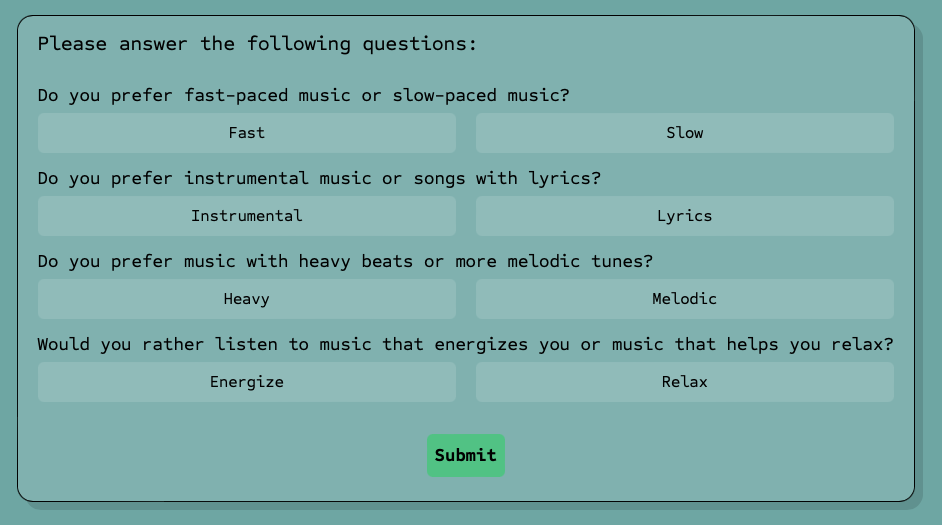
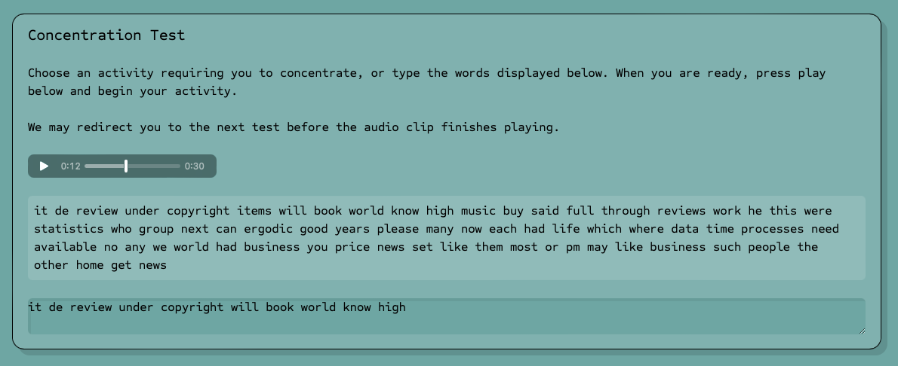
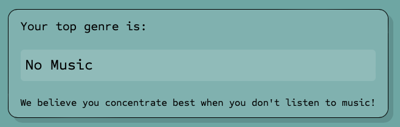
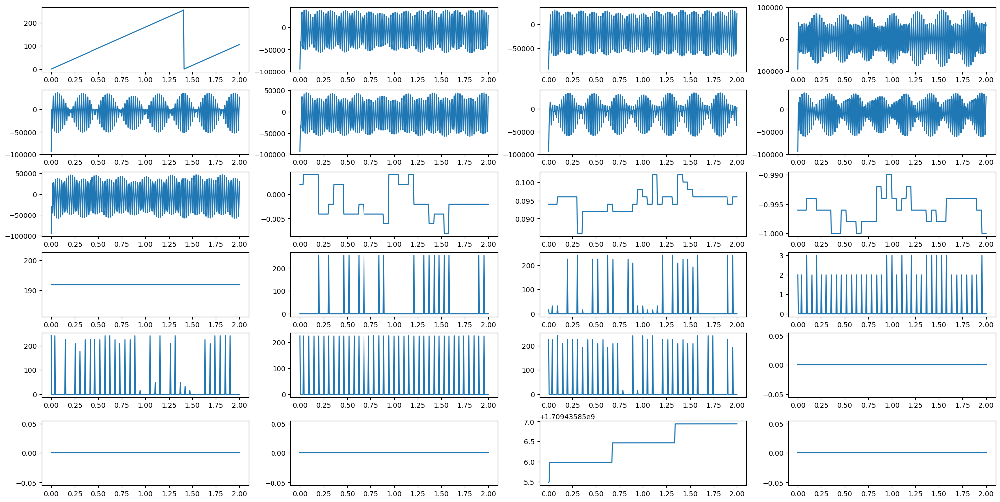

# MindTunes

Our product aims to provide a solution for each unique user to remain concentrated by taking a short test, and determining what genre of music is optimal for the user to stay concentrated.

## Description

A common problem faced by many people on focusing for extended periods of time while working on tedious or monotonous tasks. Our product aims to provide a solution for each unique user to remain concentrated by taking a short test, and determining what genre of music is optimal for the user to stay concentrated. Using Logistic Regression and $L_1$ Regularization we trained our own model, and output a number between 0 and 1 as the ” concentration” score. Where 1 leans towards being more concentrated and 0 leans towards not concentrated. Using the Open BCI Cap Kit, we measured the brain waves of the user, and determined if the user was concentrated or not, we also used ML models to plot and predict the best genre of music depending on the highest score achieved. The final product includes  a web app that asks the user a few questions to get a genre of music interests of the user, then a short typing test to serve as a concentration test while a music track is played from each of the genres, and the concentration score is measured by the model (user is wearing the cap), then an extra test with no music as that's also an option, finally we get a genre of music that the user performed the best on. One way to upscale this product is to include a playlist from top genre or maybe top 2 depending on the user's interests, meaning we offer a bit more flexibility too.

## Screenshots





## Getting Started

### Required Hardware

* You are required to have the Open BCI Cap kit in order to get the most accurate concentration score and an accurate recommendation.
* Best to take test in a quiet environment

### Dependencies

* All packages found in [`pyproject.toml`](pyproject.toml) are required in order
to run the code.
* You can install all the dependencies by running the following command in your terminal:
```bash
poetry install
```

### Execution

Feel free to tinker with the notebooks in the root directory, but in order
to tun the web app, follow the following steps:

1. Follow instructions in the Cap Kit to ensure all brain activity will be recorded accurately
2. Wear Cap and connect the Bluetooth device to computer
3. Clone this repository to your local machine
3. In Terminal, navigate to the app directory in this repository
4. Run the following command in your terminal:
```bash
python3 main.py
```

## Help

Make sure you know what port is being connected for the kit to initialize properly and record data accurately, the link is below for the exact location based on Mac/Linux/Windows OS.

* [Serial Port](https://brainflow.readthedocs.io/en/stable/SupportedBoards.html#openbci)
* [Setup Help](https://docs.openbci.com/GettingStarted/Boards/CytonGS/#:~:text=Your%20OpenBCI%20USB%20Dongle%E2%80%8B&text=The%20serial%20port%20is%20called,to%20interface%20your%20Cyton%20board.)
* [Streaming Session Help](https://openbci.com/forum/index.php?p=/discussion/2677/brainflowerror-unable-to-prepare-streaming-session)

#### IF YOUR BOARD IS NOT FUNCTIONING OR RECORDING DATA THERE ARE 2 POTENTIAL PROBLEMS ONLY.

* Batteries are dead, replace them ASAP
* Wiring is not correct, refer back to the Setup link to set up the correct wires to the correct numbers and place on the cap.

#### FINAL ASSISTANCE:

Unplug all wiring, and restart or wait for board to cool down.

## Authors

Contributor names and contact info:

* Rohan Pandey [@RohanPandey](mailto:rpande@uw.edu)
* Ray Chen [@RayChen](mailto:raychen8@uw.edu)
* Eric Ye [@EricYe](mailto:ericy4@uw.edu)
* Siddh [@Siddh](tel:4259008490)

## Version History

* 0.1
    * Initial Release

## Acknowledgments

* [@Models](https://scikit-learn.org/stable/index.html)
* [@Cap_Info](https://shop.openbci.com/products/all-in-one-gelfree-electrode-cap-bundle)